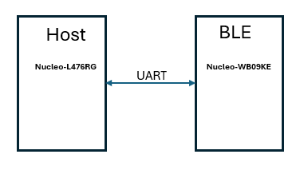
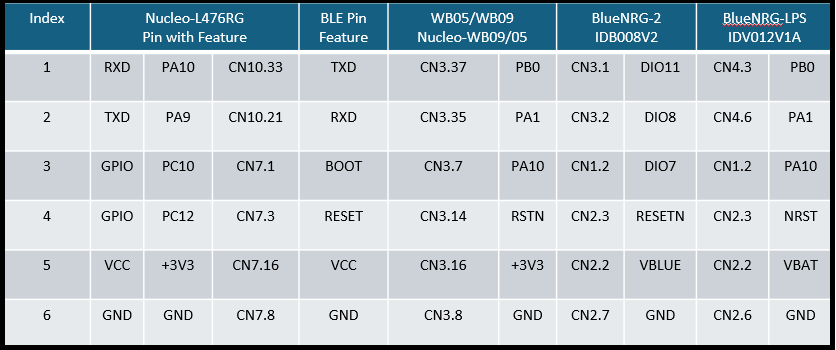
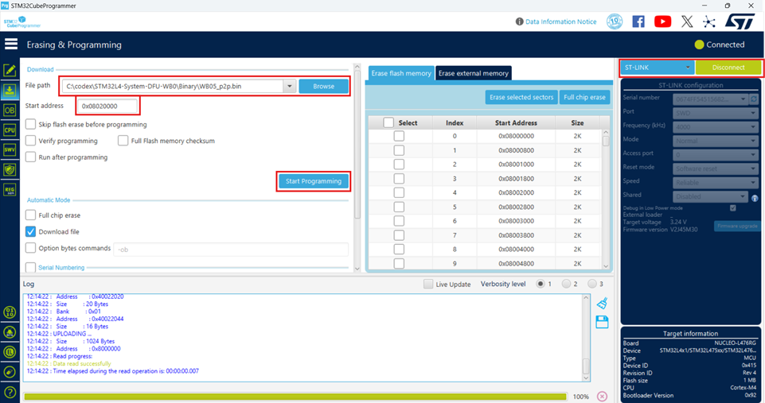
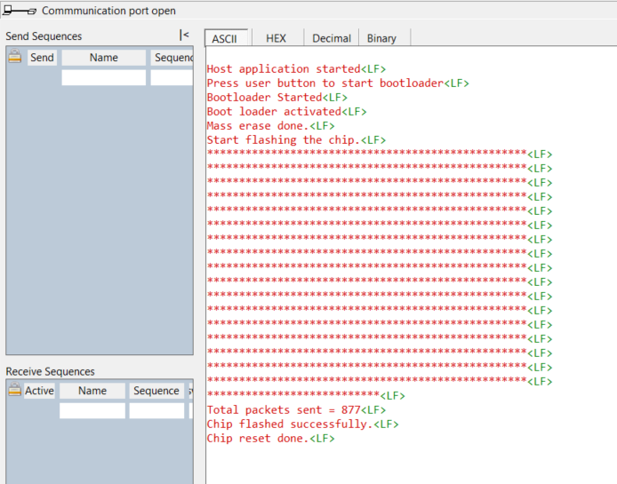

# UART Bootloader for BlueNRG-2/WB0x Example

## Overview

The objective of this project is to flash firmware into the BlueNRG-2/WB0x series of wireless devices through a UART bootloader. A WB0x is connected to an external STM32 MCU as the host (STM32L476RG in this case). The firmware for the WB0x is stored in a flash section of the host.

By pressing a button on the host, the WB0x is brought into bootloader mode, and the firmware stored in the host flash is written to it. This project has been tested with the BlueNRG-2, STM32WB05, and STM32WB09. For the purpose of project explanation, the STM32WB09 (WB09) will be used. This sample code is based on the STM32L476RG, and no code is provided for the WB0x, assuming the user will use their compiled binary to test.

### Keywords

UART, Bootloader, System Bootloader, WB0x, BlueNRG-2, STM32WB05, STM32WB09, BLE, Bluetooth, Firmware Update.

## Boards Needed

This project requires the following boards for demonstration. You will need some jumper wires for connections between the host and the BLE board.

* 1 x [Nucleo-L476RG](https://www.st.com/en/evaluation-tools/nucleo-l476rg.html) board as host MCU.
* 1 x [Nucleo-WB09KE](https://www.st.com/en/evaluation-tools/nucleo-wb09ke.html) BLE board whose firmware to be updated through UART.
* 1 x Smartphone with ST BLE Toolbox (Android or iOS) for checking BLE.

  

## Hardware configuration

* In Nucleo-WB09KE, remove the jumper shorted between pins 1 and 2 in JP1. Do the same for Nucleo-WB05. However, there is no such jumper in BlueNRG-2/LPS.
* Connect the Nucleo-L476 to your selected BLE board using jumper wires. Here, the Nucleo-WB09 is used for explanation.

  

## Pre Requirements

* Take one compiled binary file for the WB09 (e.g., wb09_p2p.bin). Make sure the binary is executing correctly.
* Erase the Nucleo-WB09 to ensure no executable exists before bootloader writing.
* Erase the Nucleo-L476.
* Establish pin connections as per the above table.
* Connect and open a terminal tool (here, Docklite) with the Nucleo-L476. Use 115200, N, 8, 1 configuration.
* There is no need to connect the WB09 board to power. It gets power from the Nucleo-L476 through the VCC connection.

## How to activate UART bootloader of WB09

* Using STM32CubeProg, flash the wb09_p2p.bin file at 0x08020000 of the Nucleo-L476RG. Here, we are storing the binary of the WB09 in the L476 flash; the same will be transferred to the WB09 during the demonstration. The STM32L476RG flash is divided into two parts; refer to the linker file (.ld). The first section is for the application, which starts from 0x08000000, and the second is for storing the WB09 firmware, which starts from 0x08020000. See the image below.

  

* Flash the binary to the Nucleo-L476 and check the console in Docklite; you will notice something similar to the image below..
  

* Press the user push-button on the Nucleo-L476 to start the process.
* The L476 brings the WB09 to bootloader mode, reads the binary from its flash location 0x08020000, and starts flashing it to the WB09.
  Refer to AN5471 for more details. [AN5471](https://www.st.com/resource/en/application_note/an5471-the-bluenrglp-uart-bootloader-protocol-stmicroelectronics.pdf)
* Below is a signal similar to that seen on an oscilloscope. The signal time is not proportional in the image. In the application, it is used as 100 ms; you can optimize these delay timings as per the datasheet.

* Scan with the ST BLE Toolbox (smartphone app) and check for the device in the scanning list.

## Known issues

* Binary file size: The full flash size is flashed to the BLE WB09 even if the program size is less. There is no storing of the binary file size.
* Residual bytes not flashed: Each time, 224 bytes are written to the WB09. The last residual binary chunk is not written to the WB09. For example, if the flash size is 512 KB = 524,288 bytes, the residual bytes will be 524,288 % 224 = 128 bytes.

## Troubleshooting

**Caution**:

* Make sure the wiring is correct. Any missing wiring will lead to failure.
* Ensure both Nucleo boards are in good and working condition.
